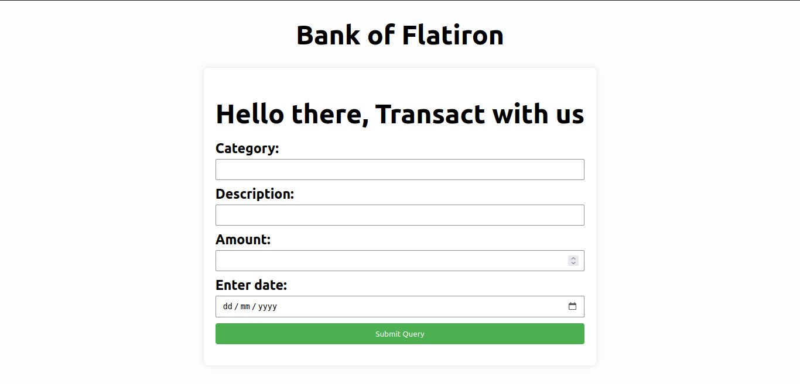
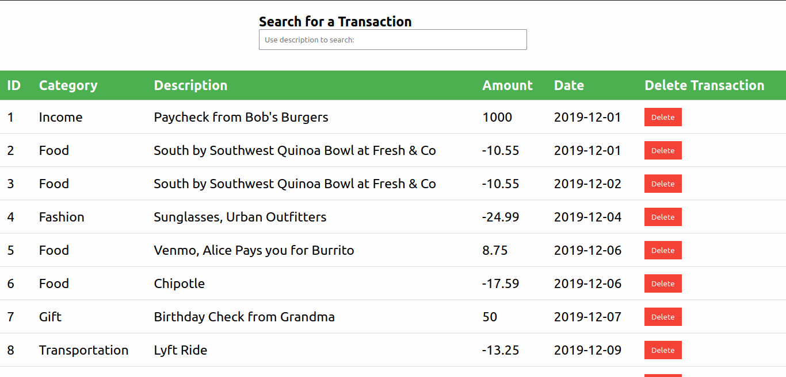

# Flatiron Banking app(Phase 2 codeChallenge1)

#### Created By Martin Nyaga 21-7-2023

## Git Link

[Git](https://github.com/MartinNyaga/Bank-of-Flatiron)

## Description

Flatiron banking app is a webapp used for tracking user transactions in the bank. The app uses a form that the user can enter details of the transaction. The transactions are then displayed on a table for interaction. The user also has a search bar for searching according to description. The user can also delete a transaction if need be.

## Setup Requirements

- Git
- Web-browser of your choice
- Github

## Development server

This app uses  a db.json that is deployed to render on 'https://bank-data-szbr.onrender.com/transactions' for the transaction list.

## Technologies Used

The following have been used on this project:

- HTML
- CSS
- JavaScript

## Screenshots 

- Transaction Form 

  

- Transaction Search Bar and Table 

  

## Known Bugs

No known bugs at the moment

## Support and contact details 

To make a contribution to the code used or any suggestions you can click on the contact link and email me your suggestions.

- Email: martin.nyaga@student.moringaschool.com

## License

Copyright (c) {{ 2023 }}, {{ Martin Nyaga }}

Permission to use, copy, modify, and/or distribute this software for any
purpose with or without fee is hereby granted, provided that the above
copyright notice and this permission notice appear in all copies.

THE SOFTWARE IS PROVIDED "AS IS" AND THE AUTHOR DISCLAIMS ALL WARRANTIES WITH
REGARD TO THIS SOFTWARE INCLUDING ALL IMPLIED WARRANTIES OF MERCHANTABILITY AND
FITNESS. IN NO EVENT SHALL THE AUTHOR BE LIABLE FOR ANY SPECIAL, DIRECT,
INDIRECT, OR CONSEQUENTIAL DAMAGES OR ANY DAMAGES WHATSOEVER RESULTING FROM
LOSS OF USE, DATA OR PROFITS, WHETHER IN AN ACTION OF CONTRACT, NEGLIGENCE OR
OTHER TORTIOUS ACTION, ARISING OUT OF OR IN CONNECTION WITH THE USE OR
PERFORMANCE OF THIS SOFTWARE.